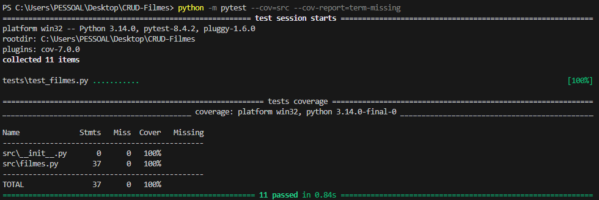

 CRUD de Filmes - Avaliação Unidade 1

 Descrição
Aplicação simples em Python para gerenciar um catálogo de filmes  
O foco do projeto é testar as regras de negócio com os testes unitários automatizados (Pytest)

 Regras de Negócio Testadas
1. O título do filme não pode ser vazio 
2. A nota do filme deve estar entre 0 e 10 
3. O gênero não pode ser vazio  
4. Não é permitido cadastrar filmes duplicados(mesmo título, independente de maiúsculas/minúsculas).  
5. Deve ser possível buscar filmes pelo título  
6. Deve ser possível remover filmes do catálogo  
7. Tentar remover um filme inexistente deve retornar False

No terminal coloque: python -m pytest --cov=src --cov-report=term-missing

# Resultado

By Kevin Marques 
